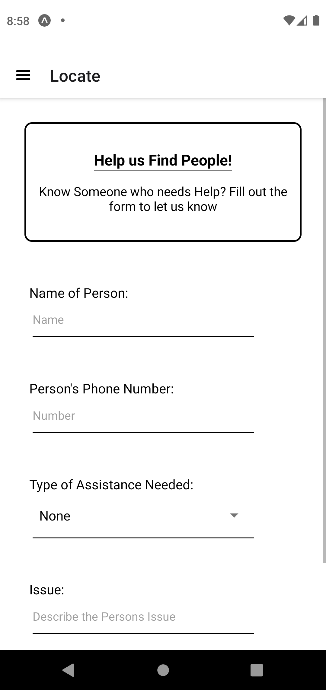

# Al-Akhi - NGO's Portal

    
    
    
    
    

A comprehensive portal designed to streamline the process of gathering donations and managing volunteers through user-friendly forms. The platform also showcases the names of dedicated volunteers who have contributed to various NGO initiatives, fostering a sense of community and recognition.

### Features:
- Donation Collection: Secure and easy-to-use forms for collecting donations.
- Volunteer Management: Simplified forms for volunteer registration and management.
- Volunteer Recognition: Displays the names of volunteers who have contributed to NGO initiatives.
- User-Friendly Interface: Intuitive design built with React Native for seamless user experience.
- Real-Time Data Handling: Powered by Firebase for efficient data storage and retrieval.

### Technologies Used:
Frontend
- React Native: Framework for building native apps using React.
- JavaScript: Programming language for web development.
- React Navigation: Routing and navigation for React Native apps.

Other Dependencies:
- @react-native-async-storage/async-storage
- @react-navigation/drawer
- @react-navigation/native
- @react-navigation/native-stack
- react-native-screens
- react-native-web

---------------------------------------------------------------
Thank you for using the NGO Portal! Together, we can make a difference.